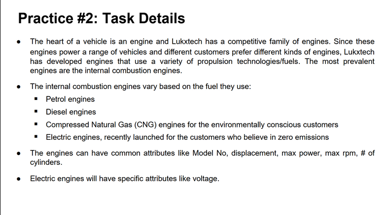
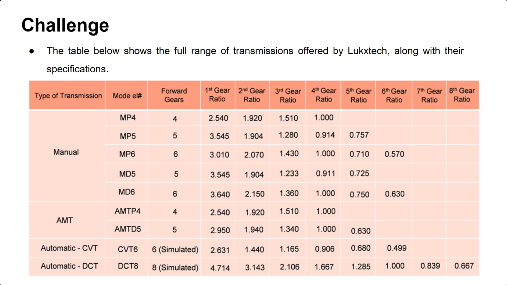

# LuxtechVehicleConfigurationSystem
A codebase born from the whole, "I am bored, and I have nothing better to do today".
This project aims to provide a framework for vehicle configuration system.

PS: Yes, that's a typo in `Luxtech`, should be `Lukxtech`

---

## Features
- Modular to a T
- Consistent Architectural Pattern
- Custom Enums, Exceptions, Builders and Factories
- Immense Scalability(only bogged down by good ol' me)

---

## Why?
> Because I can.

Alright, truthfully, it all started from this:

This was lowkey easy to implement, however, I got infatuated by...."specific attributes". Mechaical or Automobile Engineering have never been my domain, but I am rather infatuated by how machines(in this case, vehicles) work and how they can be configured to meet specific needs. So, welp, I asked some specific attributes of engines from ChatGPT, and implemented all that.

This codebase would have been benched if not for this:

Oh, the thrill. Implemented that and thought to myself....hmm, what does it take to make a vehicle? Annnnnd....here we are.

---

## Next Steps
See, this codebase doesn't have any SRS or formal planning or structure. Its more of an exploratory project. However after writing the DCT Transmission, I have some plans

- [ ] Create and maintain a CHANGELOG.md
- [ ] Decide a LICENSE
- [ ] Create a roadmap
- [ ] Implement all the parts necessary for a vehicle
    - [ ] {Insert Vehicle Parts here...}
- [ ] Write tests for all components(This project doesn't have Maven, so its prolly going to be manual)
- [ ] Write a Vehicle Implementation and integrate everything
- [ ] Do some math on various parts and parameters
    - [ ] Can the codebase auto optimize for different vehicle types?
- [ ] Document everything

---

## Conclusion
I have no idea what I'm doing, but I'm excited to find out.
I really really hope I can continue this journey and see where it takes me.

---